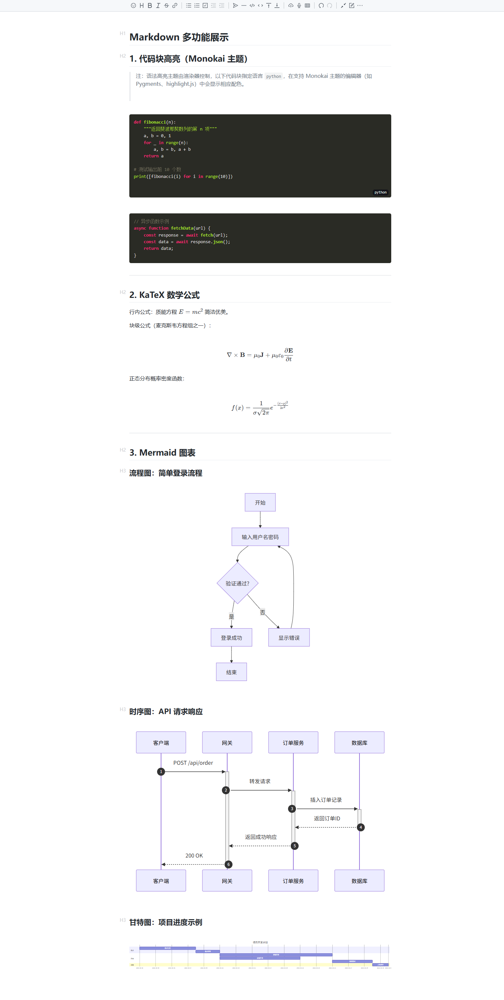
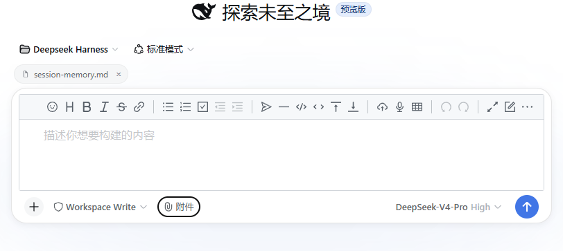

# dsh-vditor

[](https://www.npmjs.com/package/dsh-vditor)
[](./LICENSE)
[](https://github.com/Vanessa219/vditor)

让 DSH 的聊天输入更顺手——用 Vditor 即时渲染输入框，把你想说的写得漂亮、看得清楚。

## 预览

**欢迎页**


**基础功能演示**：代码块高亮、KaTeX 数学公式、Mermaid 图表



**附件路径胶囊**



## 体验亮点

### 边写边渲染的输入框

- **Markdown 所见即所得**：代码块高亮、KaTeX 数学公式、Mermaid 图表即时渲染
- **斜杠命令**：输入 `/` 快速唤起 `/goal` `/compact` `/permission` `/plan` `/export` `/feedback` `/model`，实时过滤
- **`@` 引用文件**：输入 `@` 在工作区文件里实时搜索、一键插入，Windows 路径正确渲染

### 附件与图片

- **附件路径胶囊**：选择文件后以胶囊形式展示，中文文件名与 Windows 反斜杠路径均正确显示（乱码与转义问题已修复），发送时路径自动附入消息
- **粘贴图片自动保存**：剪贴板图片直接落盘到工作区，生成路径胶囊

### 更完整的消息展示

- **完整 Markdown 渲染**：用户消息里的代码块带高亮、语言徽标和复制按钮，公式、图表正常显示
- **主题自适应**：跟随亮色 / 暗色主题自动切换

### 保留原版体验

- 模型选择、权限菜单、命令目录、上下文用量环、任务栏、统计行、余额行一应俱全
- 动态 placeholder：根据会话状态智能切换提示文案

## 安装

### 通过 `dsh plugin` 命令（推荐）

```bash
dsh plugin --profile web add github:zhy201810576/dsh-vditor
```

### 通过 npm 安装

在 profile 目录（如 `~/.dsh/profiles/web`）：

```sh
pnpm add dsh-vditor
```

然后在 profile 的 `package.json` 的 `dsh.profile.bundles` 数组中加入 `"dsh-vditor"`，重启 DSH 生效。

### 从本地源码挂载

在 profile 目录（如 `~/.dsh/profiles/web`）：

```sh
pnpm add "file:path/to/dsh-vditor"
```

然后在 profile 的 `package.json` 的 `dsh.profile.bundles` 数组中加入 `"dsh-vditor"`，重启 DSH 生效。

> **注意**：Vditor 从 `https://unpkg.com/vditor@3.11.3` 动态加载，运行时需要联网。

## 说明

- 附件只引用路径、不拷贝文件内容，模型会自行读取文件。
- 若同时启用本插件的动态（会话内）版本，会与正式版重复注册，请停用其中一个。

## License

本项目遵循 [MIT License](./LICENSE)。
